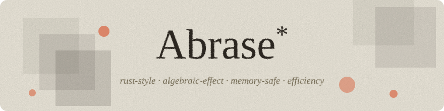

<p align="center">
  <a href="https://khn190.github.io/abrase/"></a>
</p>

<p align="center">
  
  
  
  <a href="https://khn190.github.io/abrase/"></a>
  <a href="LICENSE"></a>
</p>

<p align="center">
  <a href="https://github.com/KHN190/Abrase/actions/workflows/ci.yml"></a>
  <a href="https://codecov.io/gh/KHN190/Abrase"></a>
  <a href="https://crates.io/crates/abrase-cli"></a>
</p>

Abrase (`.abe`, abbreviated **Abe**) is a small, strongly-typed language with algebraic effects and region-based memory. Source compiles to **Polka** bytecode on the **Myriad** runtime.

One source, three ways to run:

* Add to any Rust application — zero-dependency runtime.
* Transpile to Rust (no std), run on bare metal.
* In the browser — try it [here](https://khn190.github.io/abrase/).

It is a self-hosting language. Its own memory management — allocation, reference counting, regions — is written in Abrase, equivalent to native-speed Rust.

Plus algebraic effects & handlers, a linter, and a debugger. See [wiki](https://github.com/KHN190/Abrase/wiki).

## Installation

```bash
cargo install abrase-cli

# and use
abrase run hello.abe
abrase disasm examples/nqueens.abe
```

Or download pre-compiled [GitHub Releases](https://github.com/KHN190/Abrase/releases).

## Code Editor

- [Sublime Text](https://github.com/KHN190/Abrase-sublime)
- [VS Code](https://github.com/KHN190/Abrase-vscode)

## Language Overview

```rust
effect Metric {
  op record(msg: String) -> Unit
}

fn fib(n: Int) -> <Metric> Int {
  Metric.record("entering fib({n})");
  if n < 2 { n } else { fib(n - 1) + fib(n - 2) }
}

fn main() -> Int {
  handle fib(10) {
    return v       => v,
    Metric.record msg => {
      println(msg);
      resume(())
    }
  }
}
```

## Benchmarks

Generally 2.5x better than CPython. On pure function tasks, could be ~20x faster. In most cases, it's equivalent to JIT like JavaScript in V8 engine. See [`Wiki / Optimizations`](./wiki/12-Optimizations.md).

Reproduce with [hyperfine](https://github.com/sharkdp/hyperfine).

## Polka — bytecode design

* 46 opcodes, 4 bytes each. Data & opcode are aligned.
* 128 registers per frame.

See [`Wiki / Bytecode Spec`](./wiki/Appendix-Bytecode-Spec.md).

Read about the blog [here](medium.com/p/05cb0e4df3e5).
